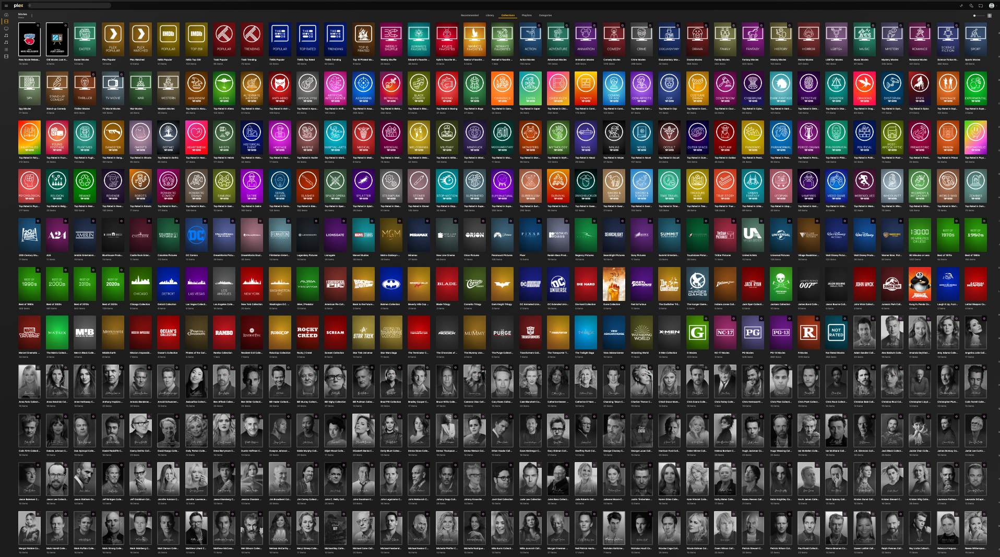

# PMM - Plex Meta Manager Configuration

This repository contains the configuration files for Plex Meta Manager (PMM). PMM is a tool used to enhance the metadata and artwork for media libraries managed by Plex.

## Description

This configuration has been customized for my specific setup and has diverged from the original fork of the repository. It is based on the original configuration files from [TheChrisK](https://github.com/TheChrisK/PMM).

## Credits

- **[TheChrisK](https://github.com/TheChrisK)**: Original configuration files and related posters
- **[meisnate12](https://github.com/meisnate12)**: Plex-Meta-Manager and related images
- **[s0len](https://github.com/s0len)**: TV overlay images
- **[pterisaur](https://github.com/pterisaur)**: People posters

## Acknowledgments

Special thanks to the contributors mentioned above for their valuable contributions to the Plex Meta Manager ecosystem.

## Usage

To use this configuration, simply clone or download the repository and follow the instructions provided in the documentation of Plex Meta Manager.

## License

This project is licensed under the [Apache License 2.0](LICENSE). See the LICENSE file for details.

## Support

For any questions or issues related to this configuration, feel free to open an issue on this repository. We'll do our best to assist you.
